# C#-VS2022 - Examen 1ev - Proyecto PilotoPharma

# 1. Enlace a Trello

https://trello.com/invite/b/eoVxfs1l/0cb81669ae9da048ebb22d7b8e774301/examen-1v-sergio-13-10-2022

# 2. Crear el proyecto y subirlo a GitHub con SourceTree

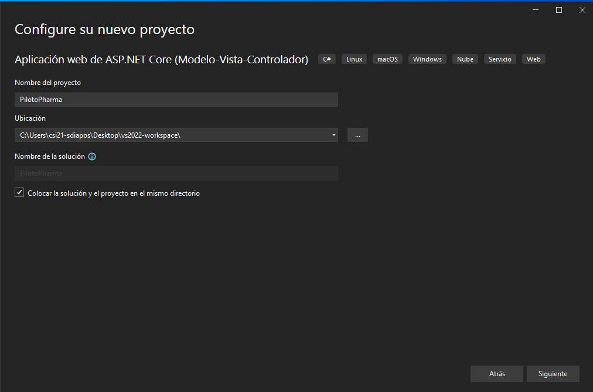

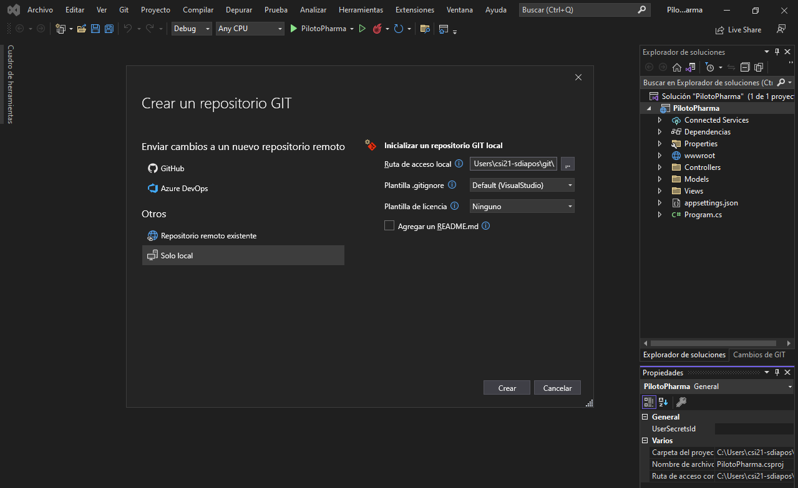

**Nota**: pensaba que con VS también había que apuntar a *usuarios --> miUsuario --> git*, pero al final he acabado apuntando a *desktop --> VS2022-workspace --> PilotoPharma*, y dentro del mismo directorio del proyecto, se ha creado el subdirectorio de *.git*

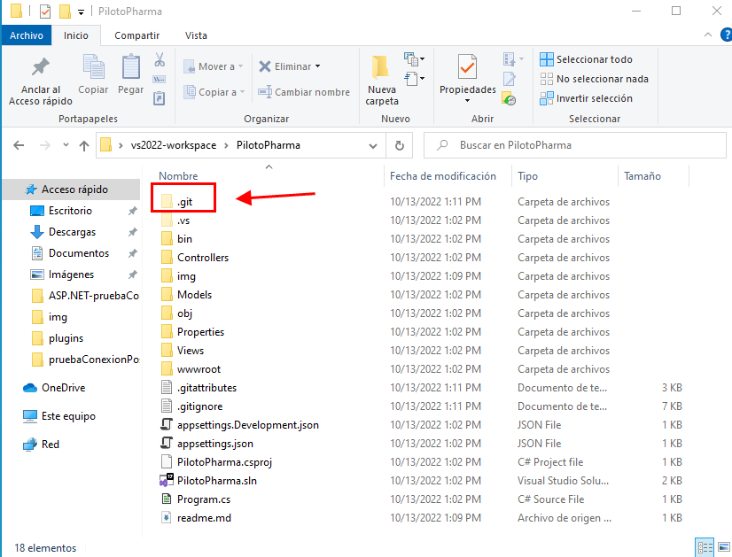

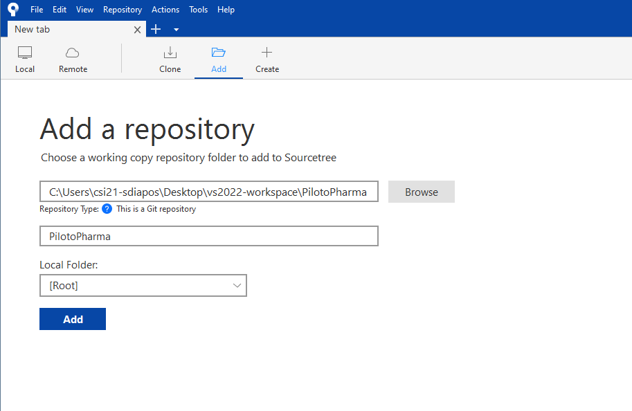

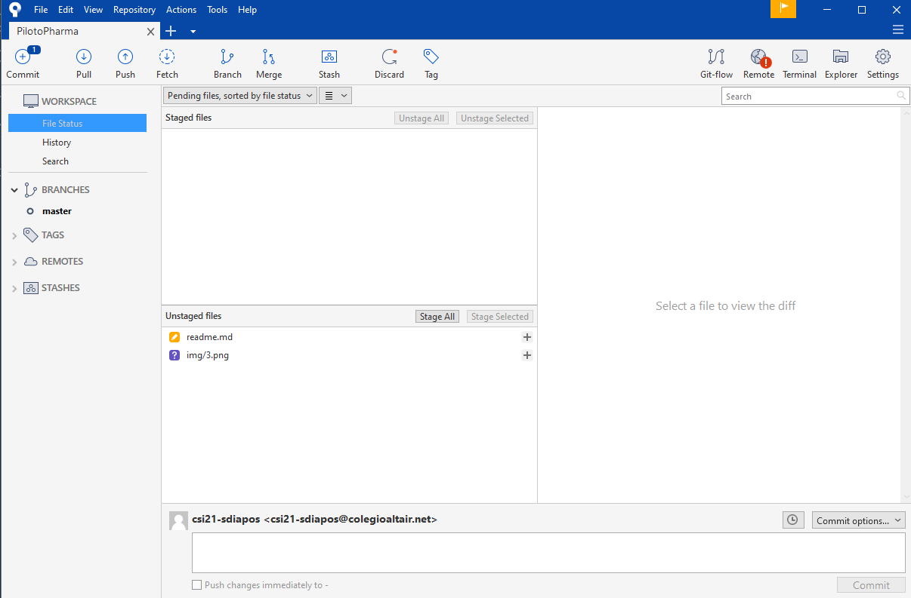

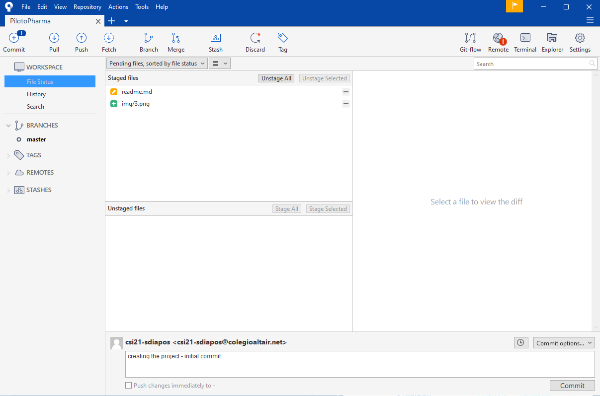

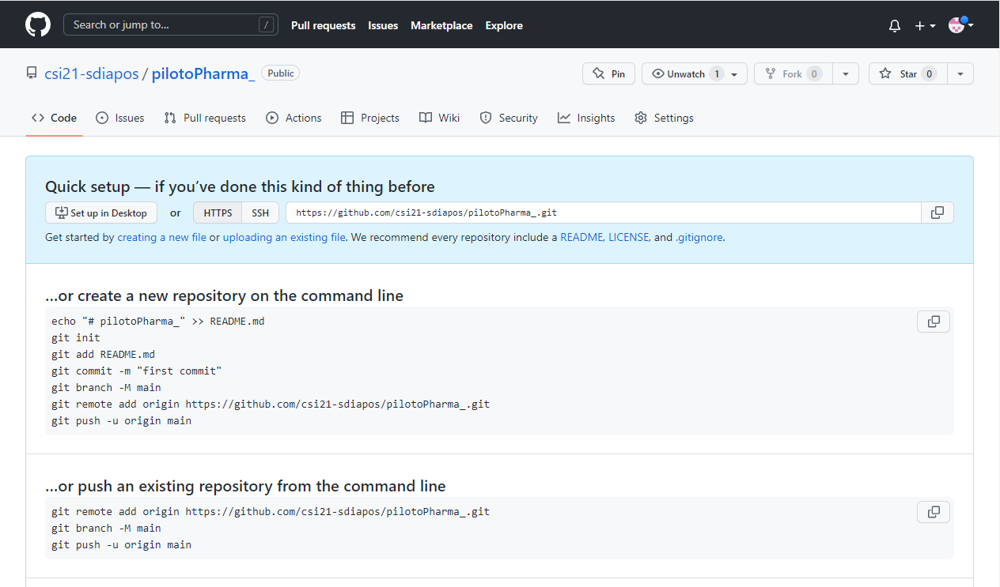

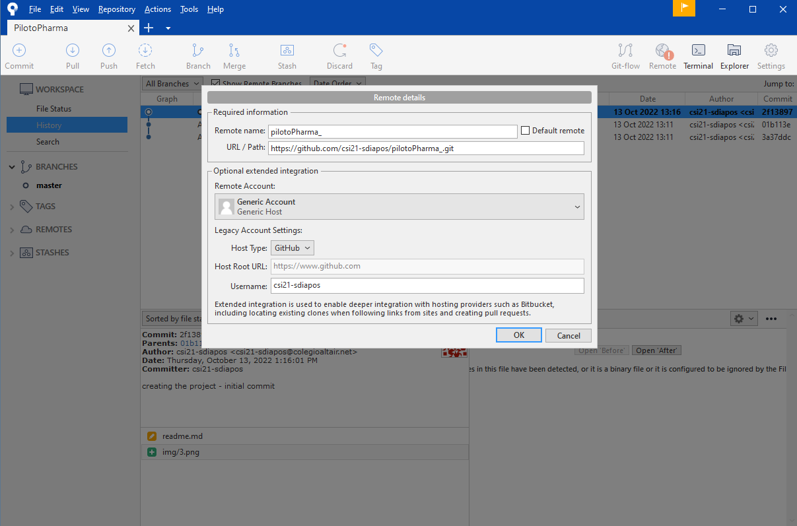

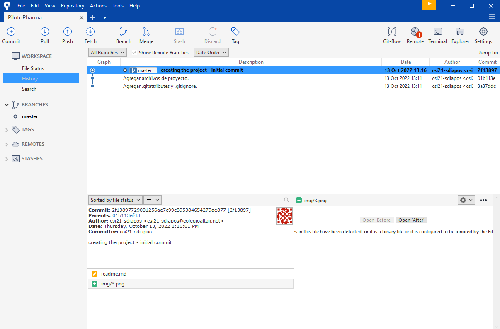

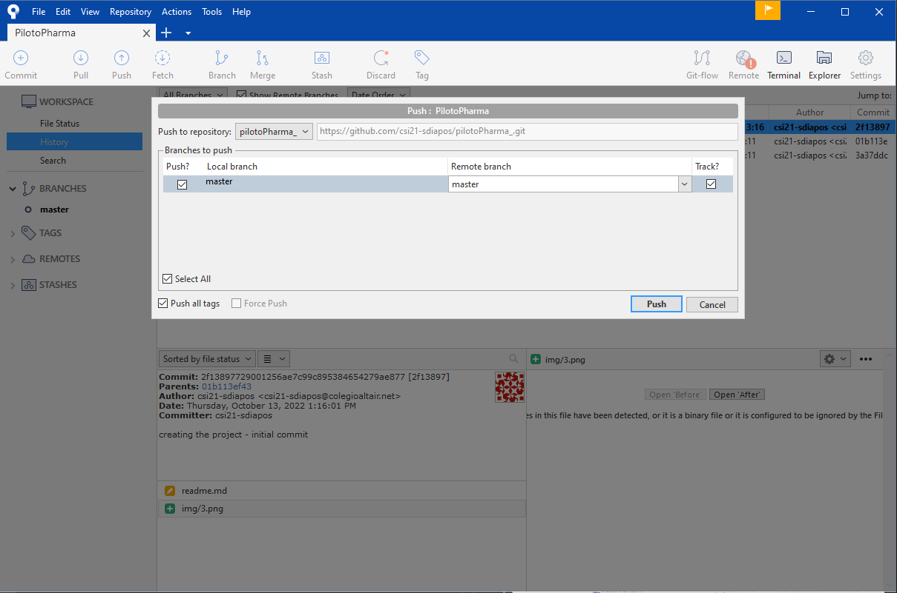

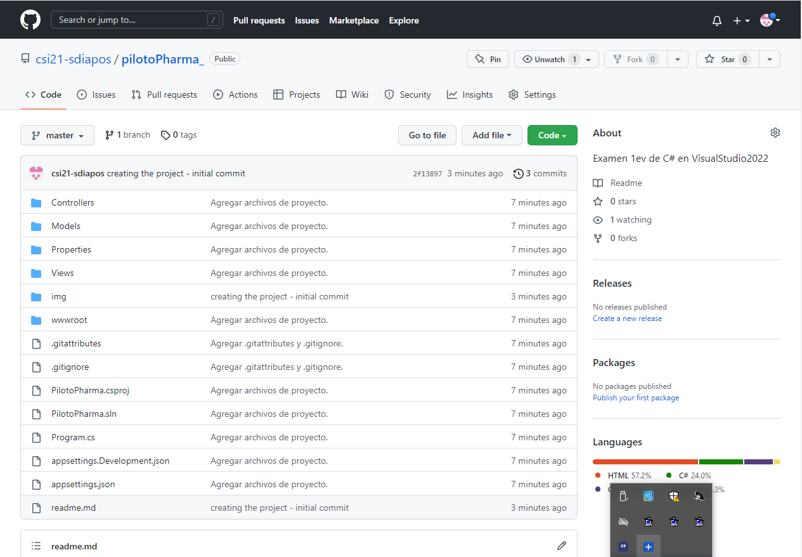

# 3. Crear la BBDD en PostgreSQL

**Nota**: Voy a reutilizar la BBDD que creé antes para la parte de Java, pero de igual modo volveré a agregar las mismas capturas de pantalla.

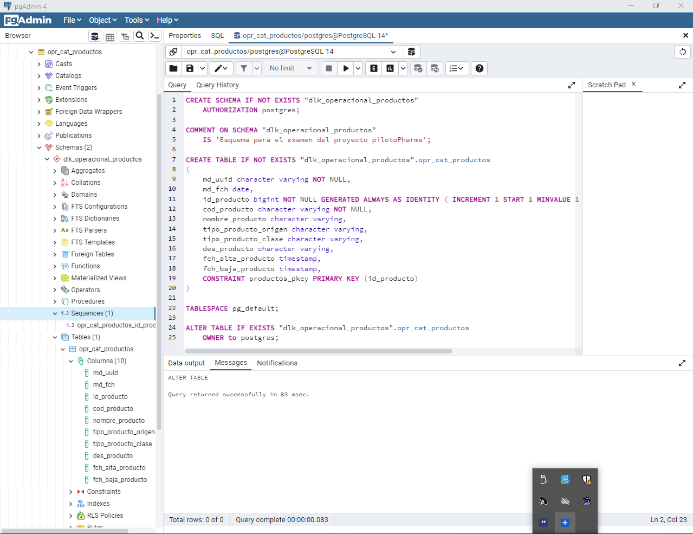

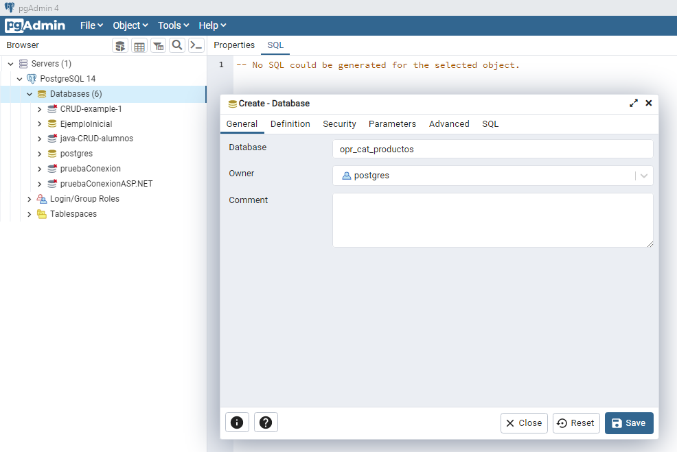

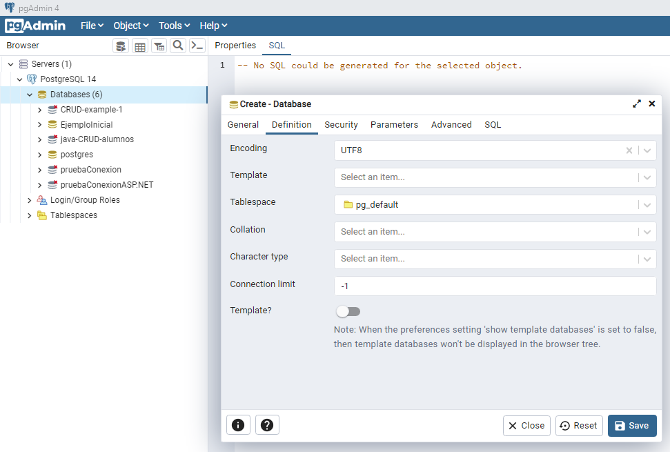

# 4. Creamos la carpeta *Util* y dentro de ella la clase *VariablesConexionPostgreSQL*.

```csharp
namespace PilotoPharma.Util
{
    public class VariablesConexionPostgreSQL
    {
        //Datos de conexión a PostgreSQL
        public const string USER = "postgres";
        public const string PASS = "12345";
        public const string PORT = "5432";
        public const string HOST = "localhost";
        public const string DB = "opr_cat_productos";
    }
}
```

# 5. Instalar el paquete NuGet de PostgreSQL

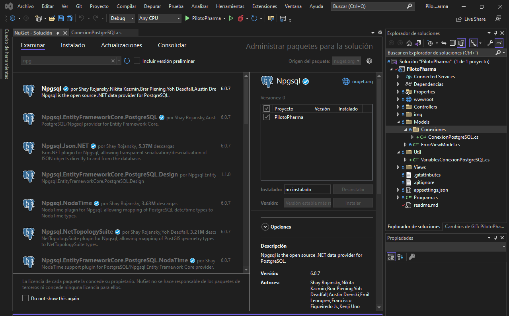

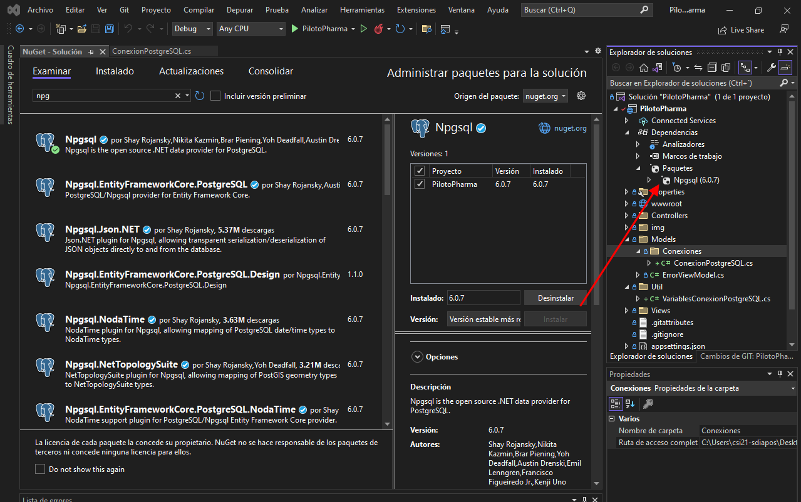

# 6. *Models --> Conexiones --> ConexionPostgreSQL.cs*

```csharp
using Npgsql;

namespace PilotoPharma.Models.Conexiones
{
    public class ConexionPostgreSQL
    {

        //MÉTODOS
        public NpgsqlConnection GeneraConexion(string host, string port, string db, string user, string pass)
        {
            System.Console.WriteLine("\n\n\t[INFORMACIÓN-GeneraPostgreSQL-GeneraConexion] Entra en GeneraConexion\n");

            //Se crea una nueva conexión y la cadena con los datos de conexión.
            NpgsqlConnection conexion = new NpgsqlConnection();
            var datosConexion = "Server=" + host + "; Port=" + port + "; User Id=" + user + "; Password=" + pass + "; Database=" + db;
            //var datosConexion = "Server=localhost; Port=5432; User Id=postgres; Password=pr0f3s0r; Database=EjemploInicial";
            System.Console.WriteLine(datosConexion);
            var estado = string.Empty;

            if (!string.IsNullOrWhiteSpace(datosConexion))
            {
                try
                {
                    conexion = new NpgsqlConnection(datosConexion);
                    conexion.Open();
                    //Se obtiene el estado de conexión para informarlo por consola
                    estado = conexion.State.ToString();
                    System.Console.WriteLine("\n\n\t[INFORMACIÓN-GeneraPostgreSQL-GeneraConexion] Estado conexión: " + estado + "\n");
                }
                catch (Exception e)
                {
                    System.Console.WriteLine("\n\n\t[ERROR-conexionPostgresql-generaConexion] Error al crear conexión:" + e + "\n");
                    conexion.Close();
                }
            }

            return conexion;

        }

        public void Close(NpgsqlConnection conexion)
        {
            conexion.Close();
        }

    }
}
```

# 7. *Models --> DTOs --> CatalogoDTO.cs*

```csharp
namespace PilotoPharma.Models.DTOs
{
    public class CatalogoDTO
    {
        // ATRIBUTOS
        string md_uuid;                     // Código de metadato que indica el grupo de inserción al que pertenece el registro.
        DateTime md_fch;                    // Fecha en la que se define el grupo de inserción.
        int id_producto;                    // Código numérico autoincremental que identifica unívocamente al producto dentro del sistema.
        string cod_producto;                // Código alfanumérico que identifica unívocamente al producto dentro del catálogo.
        string nombre_producto;             // Nombre del producto
        string tipo_producto_origen;        // Laboratorio en el que se desarrolla el producto: “Propio” o “Externo”.
        string tipo_producto_clase;         // Tipo del producto: “Analgésico”, “Antiséptico”, etc.
        string des_producto;                // Descripción básica del producto.
        DateTimeOffset fch_alta_producto;   // Fecha de alta del producto en el catálogo.
        DateTimeOffset fch_baja_producto;   // Fecha de baja del producto en el catálogo.


        // CONSTRUCTORES

        // constructor lleno
        public CatalogoDTO(string md_uuid, DateTime md_fch, int id_producto, string cod_producto, string nombre_producto, string tipo_producto_origen, string tipo_producto_clase, string des_producto, DateTimeOffset fch_alta_producto, DateTimeOffset fch_baja_producto)
        {
            this.md_uuid = md_uuid;
            this.md_fch = md_fch;
            this.id_producto = id_producto;
            this.cod_producto = cod_producto;
            this.nombre_producto = nombre_producto;
            this.tipo_producto_origen = tipo_producto_origen;
            this.tipo_producto_clase = tipo_producto_clase;
            this.des_producto = des_producto;
            this.fch_alta_producto = fch_alta_producto;
            this.fch_baja_producto = fch_baja_producto;
        }

        // constructor vacío
        public CatalogoDTO()
        {
        }


        // GETTERS Y SETTERS
        public string Md_uuid { get => md_uuid; set => md_uuid = value; }
        public DateTime Md_fch { get => md_fch; set => md_fch = value; }
        public int Id_producto { get => id_producto; set => id_producto = value; }
        public string Cod_producto { get => cod_producto; set => cod_producto = value; }
        public string Nombre_producto { get => nombre_producto; set => nombre_producto = value; }
        public string Tipo_producto_origen { get => tipo_producto_origen; set => tipo_producto_origen = value; }
        public string Tipo_producto_clase { get => tipo_producto_clase; set => tipo_producto_clase = value; }
        public string Des_producto { get => des_producto; set => des_producto = value; }
        public DateTimeOffset Fch_alta_producto { get => fch_alta_producto; set => fch_alta_producto = value; }
        public DateTimeOffset Fch_baja_producto { get => fch_baja_producto; set => fch_baja_producto = value; }


        // ToString
        public override string ToString()
        {
            return String.Format
                (
                    "\n\t{0}\t{1}\t{2}\t{3}\t{4}\t{5}\t{6}\t{7}\t{8}\t{9}",

                    md_uuid,
                    md_fch,
                    id_producto,
                    cod_producto,
                    nombre_producto,
                    tipo_producto_origen,
                    tipo_producto_clase,
                    des_producto,
                    fch_alta_producto,
                    fch_baja_producto
                );
        }
    }
}
```

# 8. *Models --> ToDTOs --> PostgreSQLToDTO.cs*

```csharp
using Npgsql;
using PilotoPharma.Models.DTOs;

namespace PilotoPharma.Models.ToDTOs
{
    public class PostgreSQLToDTOs
    {
        public static List<CatalogoDTO> ConsultaSelectCatalogoToDTO(NpgsqlDataReader resultadoConsulta)
        {
            List<CatalogoDTO> catalogo = new List<CatalogoDTO>();

            while (resultadoConsulta.Read())
            {
                catalogo.Add
                    (
                        new CatalogoDTO
                            (
                                Convert.ToString(resultadoConsulta[0]),
                                Convert.ToDateTime(resultadoConsulta[1]),
                                Convert.ToInt32(resultadoConsulta[2]),
                                Convert.ToString(resultadoConsulta[3]),
                                Convert.ToString(resultadoConsulta[4]),
                                Convert.ToString(resultadoConsulta[5]),
                                Convert.ToString(resultadoConsulta[6]),
                                Convert.ToString(resultadoConsulta[7]),
                                Convert.ToDateTime(resultadoConsulta[8]),
                                Convert.ToDateTime(resultadoConsulta[9])
                            )
                    );
            }

            return catalogo;
        }
    }
}
```

# 9. *Models --> Consultas --> ConsultasPostgreSQL.cs*

```csharp
using Npgsql;
using PilotoPharma.Models.Conexiones;
using PilotoPharma.Models.DTOs;
using PilotoPharma.Models.ToDTOs;
using PilotoPharma.Util;

namespace PilotoPharma.Models.Consultas
{
    public class ConsultasPostgreSQL
    {

        // MÉTODOS

        /****************************************** CONSULTAS SELECT *******************************************/
        public static List<CatalogoDTO> ConsultaSelectCatalogo(ConexionPostgreSQL conexionPostgreSQL)
        {
            List<CatalogoDTO> catalogo = new List<CatalogoDTO>();

            // Declaramos una conexión del tipo de nuestro NuGet de PostgreSQL, la inicializamos y construímos la conexión con los parámetros de nuestra BBDD previamente definidos en otra clase, pero traídos como constantes aquí (por razones de seguridad y abstracción)
            NpgsqlConnection conexionGenerada = new NpgsqlConnection();
            conexionGenerada = conexionPostgreSQL.GeneraConexion(VariablesConexionPostgreSQL.HOST, VariablesConexionPostgreSQL.PORT, VariablesConexionPostgreSQL.DB, VariablesConexionPostgreSQL.USER, VariablesConexionPostgreSQL.PASS);

            // Declaramos una variable para mostrar el flujo del programa por la consola y para debugear mejor en un futuro
            var estadoGenerada = string.Empty;
            estadoGenerada = conexionGenerada.State.ToString();
            System.Console.WriteLine("\n\n\t[INFORMACIÓN-ConsultasPostgreSQL.cs] Estado conexión generada: " + estadoGenerada + "\n");

            try
            {
                // Definimos la consulta y la ejecutamos
                NpgsqlCommand consulta = new NpgsqlCommand("SELECT * FROM \"dlk_operacional_productos\".\"opr_cat_productos\"", conexionGenerada);
                NpgsqlDataReader resultadoConsulta = consulta.ExecuteReader();

                // Guardamos en una lista los datos obtenidos de la consulta select
                catalogo = PostgreSQLToDTOs.ConsultaSelectCatalogoToDTO(resultadoConsulta);

                // Cerramos el flujo de los datos resultantes de la consulta
                System.Console.WriteLine("\n\n\t[INFORMACIÓN-ConsultasPostgreSQL.cs] Cierre del conjunto de datos\n");
                resultadoConsulta.Close();

                // Cerramos la conexión a nuestra BBDD
                System.Console.WriteLine("\n\n\t[INFORMACIÓN-ConsultasPostgreSQL.cs] Cierre de la conexión\n");
                conexionGenerada.Close();
            }
            catch (Exception e)
            {
                System.Console.WriteLine("\n\n\t[INFORMACIÓN-ConsultasPostgreSQL.cs] Error al ejecutar consulta: " + e + "\n");
            }

            return catalogo;
        }

        /****************************************** CONSULTAS INSERT *******************************************/

        public static void ConsultaInsertCatalogo(ConexionPostgreSQL conexionPostgreSQL)
        {
            NpgsqlConnection conexionGenerada = new NpgsqlConnection();
            conexionGenerada = conexionPostgreSQL.GeneraConexion(VariablesConexionPostgreSQL.HOST, VariablesConexionPostgreSQL.PORT, VariablesConexionPostgreSQL.DB, VariablesConexionPostgreSQL.USER, VariablesConexionPostgreSQL.PASS);

            var estadoGenerada = string.Empty;
            estadoGenerada = conexionGenerada.State.ToString();
            System.Console.WriteLine("\n\n\t[INFORMACIÓN-ConsultasPostgreSQL.cs] Estado conexión generada: " + estadoGenerada + "\n");

            try
            {
                NpgsqlCommand consulta = new NpgsqlCommand("INSERT INTO \"dlk_operacional_productos\".\"opr_cat_productos\" (md_uuid, md_fch, id_producto, cod_producto, nombre_producto, tipo_producto_origen, tipo_producto_clase, des_producto, fch_alta_producto, fch_baja_producto) VALUES ('111AAA', '2022-10-13', DEFAULT, 'a1', 'RedBull', 'denominacion EEUU', 'denominacion ESP', 'bebida energetica', TIMESTAMP '2022-10-12 13:00:00', TIMESTAMP '2022-10-13 14:00:00')", conexionGenerada);
                NpgsqlDataReader resultadoConsulta = consulta.ExecuteReader();

                System.Console.WriteLine("\n\n\t[INFORMACIÓN-ConsultasPostgreSQL.cs] Cierre del conjunto de datos\n");
                resultadoConsulta.Close();

                System.Console.WriteLine("\n\n\t[INFORMACIÓN-ConsultasPostgreSQL.cs] Cierre de la conexión\n");
                conexionGenerada.Close();
            }
            catch (Exception e)
            {
                System.Console.WriteLine("\n\n\t[INFORMACIÓN-ConsultasPostgreSQL.cs] Error al ejecutar consulta: " + e + "\n");
            }
        }
    }
}
```

# 10. *Controllers --> HomeControler --> Index()*

```csharp
public IActionResult Index()
        {
            System.Console.WriteLine("\n\n\t[INFORMACIÓN-HomeController-Index] Entra en Index\n");

            /************ Declaramos un objeto de nuestra clase ConexionPostgreSQL y lo inicializamos () ************/
            // para esto usamos su constructor vacío (que cuando una clase no tiene constructor definido, predetermiandamente lleva el constructor vacío)
            ConexionPostgreSQL conexionPostgreSQL = new ConexionPostgreSQL(); // este objeto se lo iremos pasando como parámetro en las llamadas a nuestras consultas

            /***************** Obtenemos los catálogos de la BBDD y los mostramos por consola ***************/

            List<CatalogoDTO> catalogo = new List<CatalogoDTO>();
            catalogo = ConsultasPostgreSQL.ConsultaSelectCatalogo(conexionPostgreSQL);

            System.Console.WriteLine("\n\n\tMd uuId\tMd Fecha\tID Producto\tCod Producto\tNom. Producto\tTipo Origen\t Tipo Clase\tDes. Producto\tFecha Alta\tFecha Baja");
            System.Console.WriteLine("\t-----------------------------------------------------------------------------------------");

            foreach (CatalogoDTO c in catalogo)
                System.Console.WriteLine(c.ToString());

            /*************************** Hacemos un insert de un catálogo ************************/

            ConsultasPostgreSQL.ConsultaInsertCatalogo(conexionPostgreSQL);

            /***************** Obtenemos los catalogos de la BBDD y los mostramos por consola ***************/

            catalogo = new List<CatalogoDTO>();
            catalogo = ConsultasPostgreSQL.ConsultaSelectCatalogo(conexionPostgreSQL);

            System.Console.WriteLine("\n\n\tMd uuId\tMd Fecha\tID Producto\tCod Producto\tNom. Producto\tTipo Origen\t Tipo Clase\tDes. Producto\tFecha Alta\tFecha Baja");
            System.Console.WriteLine("\t-----------------------------------------------------------------------------------------");

            foreach (CatalogoDTO c in catalogo)
                System.Console.WriteLine(c.ToString());


            /**** finalmente devolvemos la vista, al igual que cualquier otro método del tipo IActionResult ***/
            System.Console.WriteLine("\n\n\t[INFORMACIÓN-HomeController-Index] Lógica del Index finalizada\n");

            return View();
        }
```

# 10. Ejecución del proyecto.

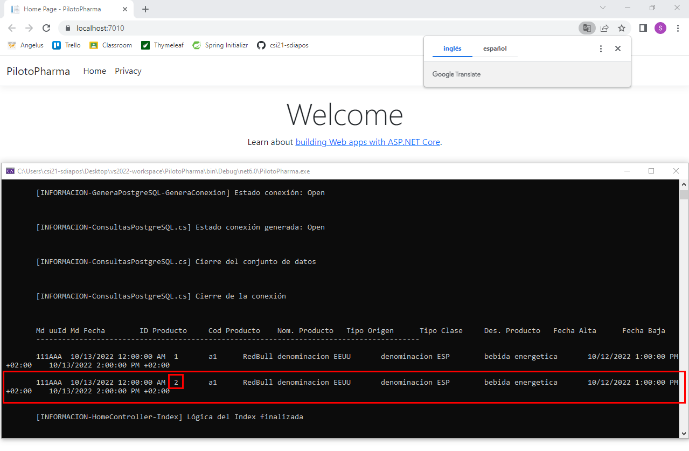

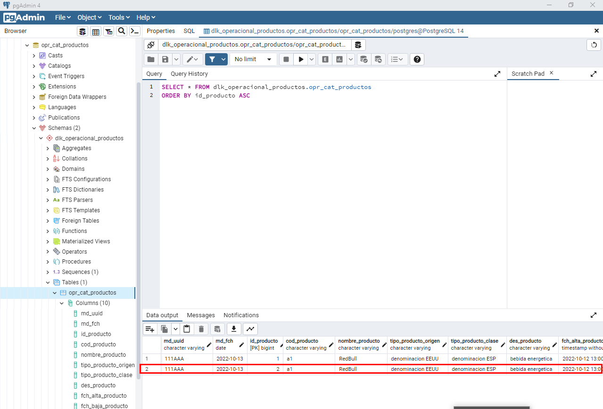

# 11. Subida final del proyecto a Github con SourceTree (last commit)

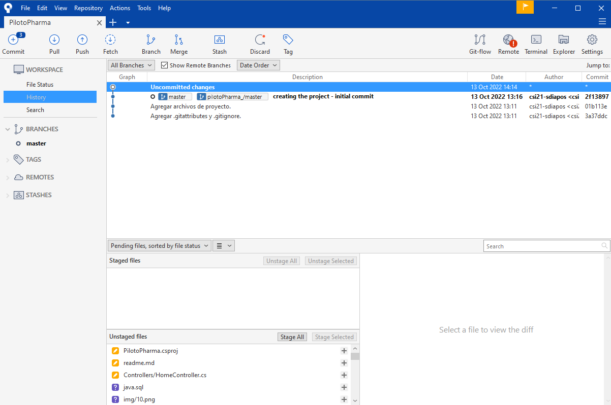

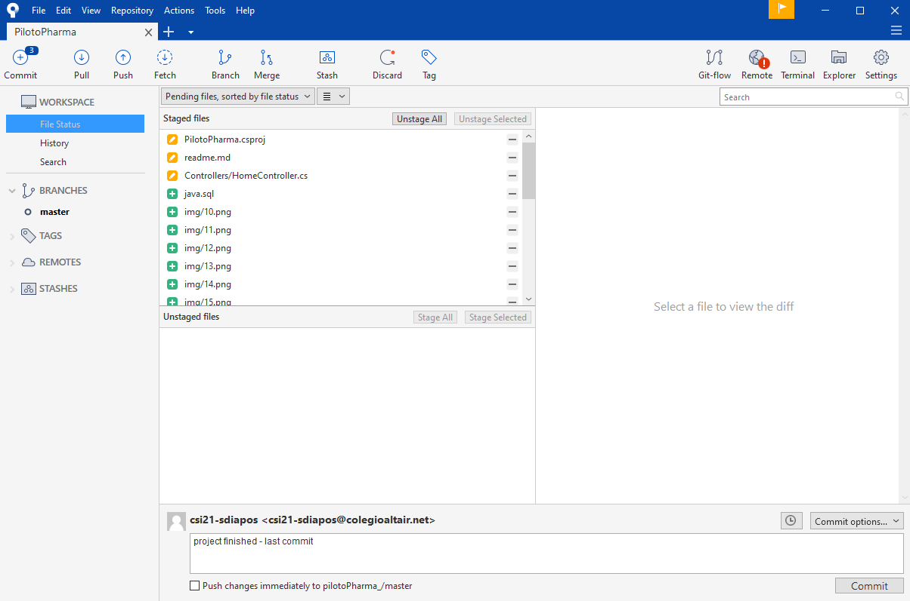

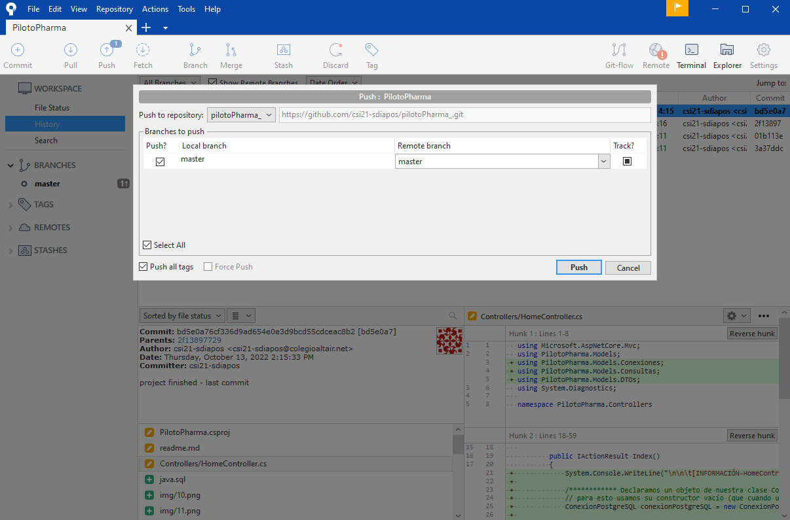

